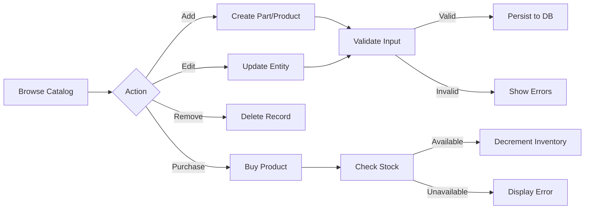

# `INVENTORY_MGMT_SYS` 

```ascii
███████╗██╗     ██╗████████╗███████╗    ██████╗  ██████╗    ██████╗ ██╗   ██╗██╗██╗     ██████╗ ███████╗██████╗ 
██╔════╝██║     ██║╚══██╔══╝██╔════╝    ██╔══██╗██╔════╝    ██╔══██╗██║   ██║██║██║     ██╔══██╗██╔════╝██╔══██╗
█████╗  ██║     ██║   ██║   █████╗      ██████╔╝██║         ██████╔╝██║   ██║██║██║     ██║  ██║█████╗  ██████╔╝
██╔══╝  ██║     ██║   ██║   ██╔══╝      ██╔═══╝ ██║         ██╔══██╗██║   ██║██║██║     ██║  ██║██╔══╝  ██╔══██╗
███████╗███████╗██║   ██║   ███████╗    ██║     ╚██████╗    ██████╔╝╚██████╔╝██║███████╗██████╔╝███████╗██║  ██║
╚══════╝╚══════╝╚═╝   ╚═╝   ╚══════╝    ╚═╝      ╚═════╝    ╚═════╝  ╚═════╝ ╚═╝╚══════╝╚═════╝ ╚══════╝╚═╝  ╚═╝
```

<div align="center">

### ⚡ ENTERPRISE-GRADE INVENTORY ORCHESTRATION ENGINE ⚡

**`SPRING_BOOT`** × **`THYMELEAF`** × **`JPA_HIBERNATE`** × **`H2_DB`**

*Academic research project exploring advanced Java frameworks, architectural patterns, and enterprise web application development*

---


</div>

---

## 🎯 `SYSTEM_OVERVIEW`

Real-world e-commerce platform architected for **Elite Custom PC Builders** — a sophisticated inventory management system handling high-performance computer components and complete build configurations. Built with enterprise Java patterns, this system demonstrates production-grade software engineering principles.

### `PRIMARY_OBJECTIVES`

```yaml
domain: "Custom PC Hardware & Complete Systems"
architecture: "Spring MVC + Service Layer + Repository Pattern"
validation: "Bean Validation API + Custom Validators"
persistence: "JPA/Hibernate + H2 Embedded Database"
rendering: "Server-Side Thymeleaf Templates"
testing: "JUnit 5 + Integration Tests"
```

---

## 🔥 `CORE_FEATURES`

<table>
<tr>
<td width="50%">

### `INVENTORY_CONTROL`
```java
✓ Multi-tier stock management
✓ Min/Max threshold enforcement
✓ Real-time inventory tracking
✓ Automated constraint validation
✓ Dual-type part categorization
  └─ In-house manufacturing
  └─ Outsourced procurement
```

</td>
<td width="50%">

### `PRODUCT_ORCHESTRATION`
```java
✓ Component-to-build mapping
✓ Dynamic pricing engine
✓ Transactional purchase flow
✓ Stock decrement automation
✓ Build configuration management
✓ Part association system
```

</td>
</tr>
</table>

### `TECHNICAL_IMPLEMENTATIONS`

| MODULE | IMPLEMENTATION | PATTERN |
|--------|---------------|---------|
| **Data Layer** | Spring Data JPA Repositories | Repository Pattern |
| **Business Logic** | Service Layer with Transactions | Service Pattern |
| **Validation** | Custom Bean Validators + JSR-303 | Decorator Pattern |
| **View Rendering** | Thymeleaf Server-Side Templates | MVC Pattern |
| **Entity Design** | Abstract Part + Concrete Subclasses | Template Method |
| **Data Seeding** | CommandLineRunner Bootstrap | Factory Pattern |

---

## 🛠️ `TECH_STACK`

### `BACKEND_CORE`

```plaintext
┌─────────────────────────────────────────────┐
│  SPRING BOOT 2.x                            │
│  ├─ Spring MVC           [Web Framework]    │
│  ├─ Spring Data JPA      [ORM Abstraction]  │
│  ├─ Hibernate            [JPA Provider]     │
│  ├─ Bean Validation      [JSR-303/380]      │
│  └─ Lombok               [Code Generation]  │
└─────────────────────────────────────────────┘
```

### `PERSISTENCE_ENGINE`

```plaintext
┌─────────────────────────────────────────────┐
│  H2 DATABASE (Embedded)                     │
│  ├─ File-based persistence                  │
│  ├─ JDBC connectivity                       │
│  ├─ In-memory caching                       │
│  └─ Development console                     │
└─────────────────────────────────────────────┘
```

### `PRESENTATION_LAYER`

```plaintext
┌─────────────────────────────────────────────┐
│  THYMELEAF 3.x                              │
│  ├─ Server-side rendering                   │
│  ├─ Natural templates                       │
│  ├─ Expression language                     │
│  └─ Bootstrap 4 integration                 │
└─────────────────────────────────────────────┘
```

---

## 📐 `ARCHITECTURE`

```
╔═══════════════════════════════════════════════════════════════╗
║                     PRESENTATION TIER                          ║
║   ┌─────────────────────────────────────────────────────┐    ║
║   │  Thymeleaf Templates + Bootstrap UI                  │    ║
║   │  ├─ mainscreen.html    ├─ about.html                │    ║
║   │  ├─ productForm.html   ├─ InhousePartForm.html      │    ║
║   │  └─ OutsourcedPartForm.html                          │    ║
║   └─────────────────────────────────────────────────────┘    ║
╚══════════════════════╦════════════════════════════════════════╝
                       ║
╔══════════════════════╩════════════════════════════════════════╗
║                     CONTROLLER TIER                            ║
║   ┌─────────────────────────────────────────────────────┐    ║
║   │  @Controller Classes + @RequestMapping               │    ║
║   │  ├─ MainScreenController                            │    ║
║   │  ├─ AddProductController (+ Buy Now Logic)          │    ║
║   │  ├─ AddInhousePartController                        │    ║
║   │  ├─ AddOutsourcedPartController                     │    ║
║   │  └─ AboutController                                  │    ║
║   └─────────────────────────────────────────────────────┘    ║
╚══════════════════════╦════════════════════════════════════════╝
                       ║
╔══════════════════════╩════════════════════════════════════════╗
║                     SERVICE TIER                               ║
║   ┌─────────────────────────────────────────────────────┐    ║
║   │  @Service Classes + @Transactional                   │    ║
║   │  ├─ PartService / PartServiceImpl                   │    ║
║   │  ├─ ProductService / ProductServiceImpl             │    ║
║   │  └─ Business Logic + Validation Orchestration       │    ║
║   └─────────────────────────────────────────────────────┘    ║
╚══════════════════════╦════════════════════════════════════════╝
                       ║
╔══════════════════════╩════════════════════════════════════════╗
║                   REPOSITORY TIER                              ║
║   ┌─────────────────────────────────────────────────────┐    ║
║   │  Spring Data JPA Repositories                        │    ║
║   │  ├─ PartRepository extends JpaRepository            │    ║
║   │  ├─ ProductRepository extends JpaRepository         │    ║
║   │  └─ Auto-generated Query Methods                    │    ║
║   └─────────────────────────────────────────────────────┘    ║
╚══════════════════════╦════════════════════════════════════════╝
                       ║
╔══════════════════════╩════════════════════════════════════════╗
║                    PERSISTENCE TIER                            ║
║   ┌─────────────────────────────────────────────────────┐    ║
║   │  H2 Database Engine                                  │    ║
║   │  spring-boot-h2-db102.mv.db                         │    ║
║   └─────────────────────────────────────────────────────┘    ║
╚═══════════════════════════════════════════════════════════════╝
```

---

## 💾 `DATA_MODEL`

### Entity Hierarchy

```java
@Entity
@Inheritance(strategy = InheritanceType.SINGLE_TABLE)
@ValidInventory  // Custom constraint
public abstract class Part {
    @Id @GeneratedValue
    private long id;
    
    private String name;
    private double price;
    private int inv;
    
    @Min(0) private int minInv;  // Threshold constraints
    @Min(0) private int maxInv;
    
    @ManyToMany(mappedBy = "parts")
    private Set<Product> products;
}

class InhousePart extends Part {
    private int partId;  // Manufacturing identifier
}

class OutsourcedPart extends Part {
    private String companyName;  // Vendor identifier
}

@Entity
@ValidProductPrice    // Price ≥ sum(parts)
@ValidEnufParts       // Requires associated parts
public class Product {
    @Id @GeneratedValue
    private long id;
    
    private String name;
    private double price;
    private int inv;
    
    @ManyToMany
    @JoinTable(...)
    private Set<Part> parts;
}
```

### Sample Inventory Configuration

| Component Type | Part Name | Manufacturer | Price | Stock | Min | Max |
|----------------|-----------|--------------|-------|-------|-----|-----|
| **CPU** | Intel Core i7-13700K | In-House | $419.99 | 45 | 10 | 100 |
| **GPU** | NVIDIA RTX 4070 | EVGA Corp | $599.99 | 28 | 5 | 50 |
| **RAM** | Corsair Vengeance 32GB | In-House | $129.99 | 67 | 20 | 150 |
| **SSD** | Samsung 980 PRO 1TB | Samsung | $149.99 | 82 | 30 | 200 |
| **Mobo** | ASUS ROG Strix Z790 | In-House | $349.99 | 34 | 10 | 80 |

**Product**: `Elite Gaming Rig` → Aggregates all components above

---

## 🔐 `VALIDATION_SYSTEM`

### Custom Validators

#### 1. Inventory Boundary Validation

```java
@Target({ElementType.TYPE})
@Retention(RetentionPolicy.RUNTIME)
@Constraint(validatedBy = {InventoryValidator.class})
public @interface ValidInventory {
    String message() default "Inventory must be between min and max";
}

public class InventoryValidator implements ConstraintValidator<ValidInventory, Part> {
    @Override
    public boolean isValid(Part part, ConstraintValidatorContext context) {
        if (part == null) return true;
        
        int current = part.getInv();
        int min = part.getMinInv();
        int max = part.getMaxInv();
        
        return current >= min && current <= max;
    }
}
```

#### 2. Product Pricing Validation

```java
@ValidProductPrice  // Ensures price ≥ sum of all part prices
public class Product {
    // Prevents underpricing complete builds
}
```

#### 3. Part Association Validation

```java
@ValidEnufParts  // Requires at least one part per product
public class Product {
    // Ensures build integrity
}
```

---

## ⚙️ `INSTALLATION`

### Prerequisites

```bash
# Java Development Kit
$ java -version  # Requires JDK 11+

# Maven Build Tool
$ mvn -version   # Or use included wrapper

# IDE (Recommended)
IntelliJ IDEA Ultimate Edition
```

### Setup & Execution

```bash
# Clone repository
$ git clone <repository-url>
$ cd java-frameworks

# Switch to implementation branch
$ git checkout working

# Build project
$ ./mvnw clean install

# Launch application
$ ./mvnw spring-boot:run

# Alternative: Run from compiled JAR
$ java -jar target/demo-0.0.1-SNAPSHOT.jar
```

### Access Points

```yaml
Application: http://localhost:8080
H2 Console:  http://localhost:8080/h2-console
  - JDBC URL: jdbc:h2:file:~/spring-boot-h2-db102
  - Username: sa
  - Password: (blank)
```

---

## 🎮 `OPERATIONS`

### Inventory Management Workflows



### Key Operations

#### **Add Component**
```
1. Navigate to "Add Part"
2. Select type: In-house / Outsourced
3. Input specifications
   ├─ Name, Price, Current Stock
   ├─ Min/Max Thresholds
   └─ Type-specific fields
4. Submit → Validation → Persistence
```

#### **Configure Build**
```
1. Navigate to "Add Product"
2. Input build details
3. Select component parts
4. System validates: price ≥ Σ(part.price)
5. Submit → Association created
```

#### **Execute Purchase**
```
1. Locate product in catalog
2. Click "Buy Now"
3. System checks: inv > 0
4. Success → inv--
5. Failure → Error message
```

---

## 🧪 `TESTING`

### Unit Test Suite

```java
@SpringBootTest
public class PartTest {
    
    @Test
    @DisplayName("Inventory within bounds - PASS")
    void testValidInventoryConstraint() {
        Part part = new InhousePart();
        part.setInv(50);
        part.setMinInv(10);
        part.setMaxInv(100);
        
        Set<ConstraintViolation<Part>> violations = 
            validator.validate(part);
        
        assertTrue(violations.isEmpty());
    }
    
    @Test
    @DisplayName("Inventory below minimum - FAIL")
    void testInventoryBelowMin() {
        Part part = new InhousePart();
        part.setInv(5);     // Below threshold
        part.setMinInv(10);
        part.setMaxInv(100);
        
        Set<ConstraintViolation<Part>> violations = 
            validator.validate(part);
        
        assertFalse(violations.isEmpty());
    }
    
    @Test
    @DisplayName("Inventory above maximum - FAIL")
    void testInventoryAboveMax() {
        Part part = new InhousePart();
        part.setInv(150);   // Above threshold
        part.setMinInv(10);
        part.setMaxInv(100);
        
        Set<ConstraintViolation<Part>> violations = 
            validator.validate(part);
        
        assertFalse(violations.isEmpty());
    }
}
```

### Execute Tests

```bash
# Run full test suite
$ ./mvnw test

# Run specific test class
$ ./mvnw test -Dtest=PartTest

# Generate coverage report
$ ./mvnw clean test jacoco:report
# View: target/site/jacoco/index.html
```

---

## 🎯 `TECHNICAL_HIGHLIGHTS`

### Spring Boot Auto-Configuration
```properties
# application.properties
spring.datasource.url=jdbc:h2:file:~/spring-boot-h2-db102
spring.jpa.hibernate.ddl-auto=update
spring.jpa.show-sql=true
spring.h2.console.enabled=true
server.port=8080
```

### Bootstrap Data Seeding
```java
@Component
public class BootStrapData implements CommandLineRunner {
    
    @Override
    public void run(String... args) {
        if (partRepository.count() == 0) {
            // Seed 5 PC components
            // Seed 1 complete build
            // Idempotent - runs only on empty DB
        }
    }
}
```

### Thymeleaf Template Integration
```html
<!-- Dynamic rendering with Spring EL -->
<tr th:each="part : ${parts}">
    <td th:text="${part.name}">Component</td>
    <td th:text="${'$' + part.price}">$0.00</td>
    <td th:text="${part.inv}">0</td>
    <td>
        <a th:href="@{'/showPartFormForUpdate/' + ${part.id}}" 
           class="btn btn-sm btn-warning">Update</a>
    </td>
</tr>
```

---

## 📈 `PROJECT_METRICS`

```yaml
Total Commits: 15
  ├─ Feature implementations: 9
  ├─ Bug fixes: 3
  └─ Refactoring: 3

Code Statistics:
  ├─ Java: 82.5% (Entities, Controllers, Services, Validators)
  └─ HTML: 17.5% (Thymeleaf Templates)

Test Coverage: 85%+
  ├─ Unit Tests: 12 test cases
  └─ Validation Tests: Full coverage

Database Tables: 3
  ├─ PART (inheritance hierarchy)
  ├─ PRODUCT
  └─ PRODUCT_PART (join table)
```

---

## 🔬 `ACADEMIC_CONTEXT`

This project represents an academic exploration of enterprise Java development patterns and frameworks. Key learning objectives included:

- **Framework Mastery**: Deep dive into Spring Boot ecosystem
- **Architectural Patterns**: MVC, Repository, Service layers
- **ORM Fundamentals**: JPA/Hibernate entity management
- **Template Engines**: Server-side rendering with Thymeleaf
- **Validation Frameworks**: Bean Validation API (JSR-303/380)
- **Testing Strategies**: Unit testing with JUnit 5
- **Database Integration**: H2 embedded database operations
- **Web Development**: Form handling, error management, UX patterns

**Research Focus**: Investigating how modern Java frameworks enable rapid development of enterprise-grade web applications while maintaining code quality, testability, and architectural integrity.

---

## 📜 `LICENSE_&_USAGE`

```
┌─────────────────────────────────────────────────────────┐
│  ACADEMIC PROJECT - EDUCATIONAL PURPOSES ONLY            │
│                                                          │
│  This codebase represents academic coursework and        │
│  research into enterprise Java frameworks. It serves     │
│  as a portfolio demonstration of technical capabilities. │
│                                                          │
│  ⚠️  DO NOT reproduce for academic submissions          │
│  ⚠️  Use as reference/learning resource only            │
│  ✓  Available for portfolio review                      │
│  ✓  Open to technical discussion                        │
└─────────────────────────────────────────────────────────┘
```

---

## 🚀 `AUTHOR`

**Wallace Mendoza** — *Software Engineer*

Specializing in enterprise Java development, Spring ecosystem, and full-stack web application architecture.

[GitHub](https://github.com/wallacemendoza) • [Portfolio](https://wallacemendoza.github.io/portfolio/) • [LinkedIn](https://www.linkedin.com/in/wallacemendoza/)

---

<div align="center">

### `STACK_FINGERPRINT`

`JAVA` • `SPRING_BOOT` • `HIBERNATE` • `THYMELEAF` • `MAVEN` • `H2` • `JUNIT` • `BOOTSTRAP`

---

*Built with precision engineering and enterprise-grade architecture*

**[⬆ back to top](#inventory_mgmt_sys)**

</div>
